<p align="center">
  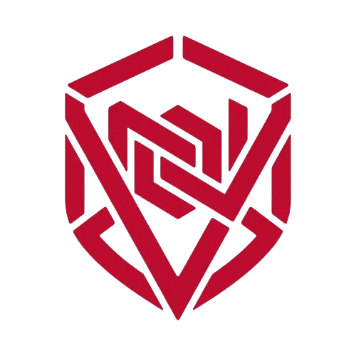
</p>

# NexusVault

NexusVault is a high-performance, decentralized-first developer platform optimized for repository hosting, code intelligence, and high-concurrency data management. It provides a seamless bridge between a specialized Lua-driven IDE and a robust TypeScript-powered server cluster.

---

## Technical Showcase

The following interfaces represent the core operational environment of NexusVault, highlighting the direct integration between local development and cloud-scale synchronization.

### Repository Control Center
| Interface Segment | Operational Context |
| :--- | :--- |
| **Hero section** | 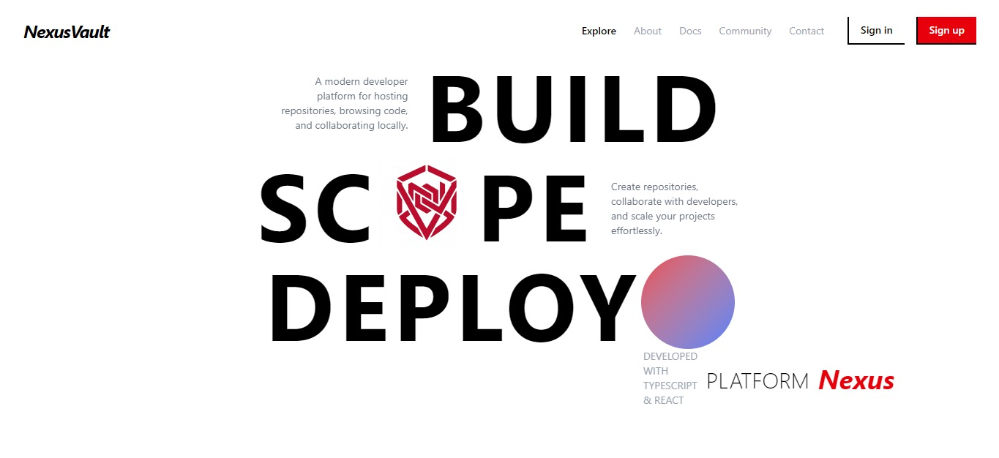 |
| **Profile page** | 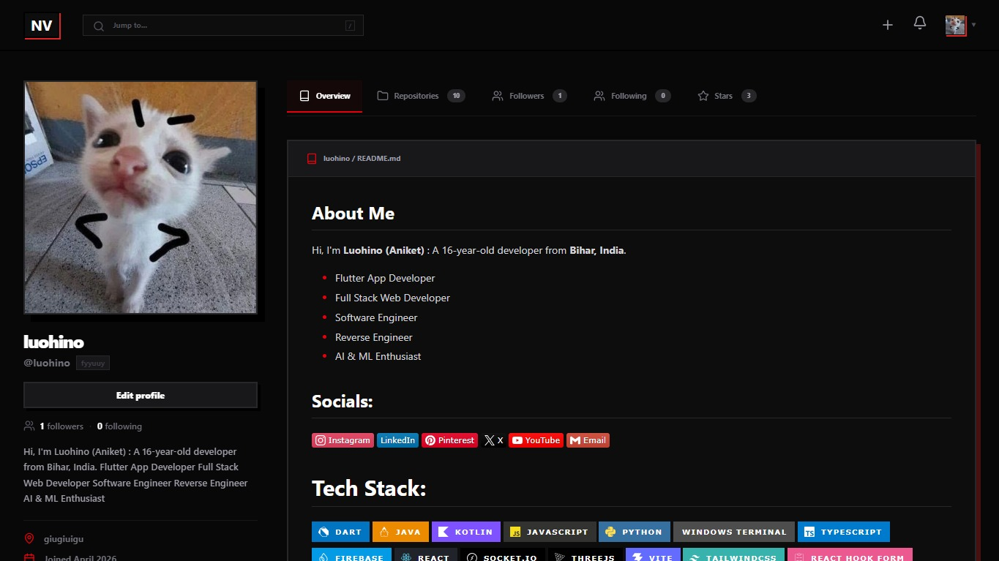 |
| **Home Page** | 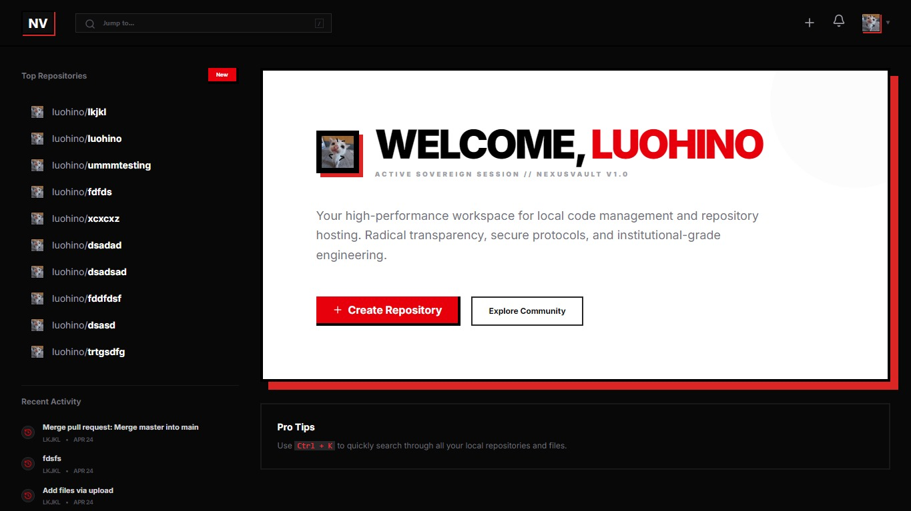 |
| **Repo** | 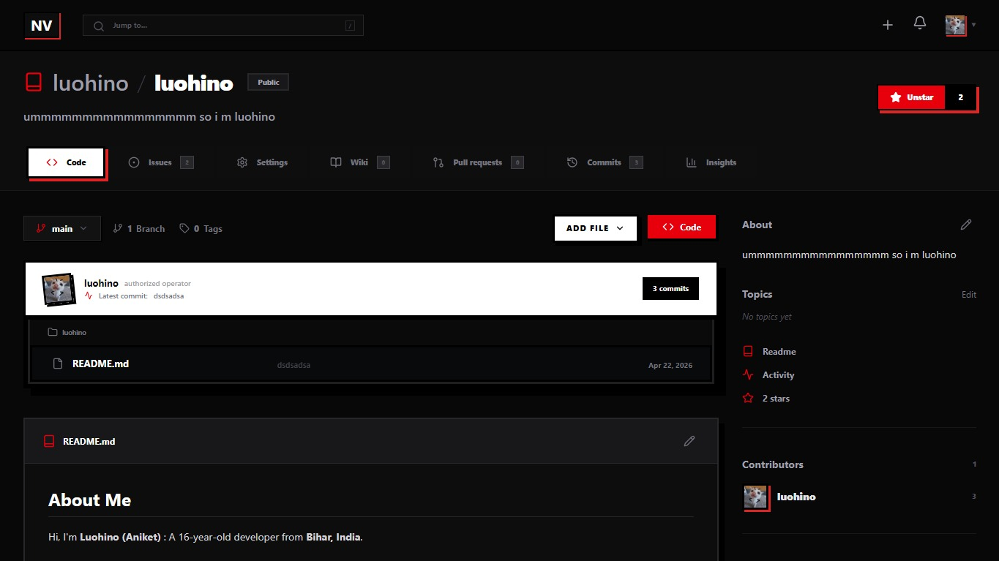 |
| **Settings** | 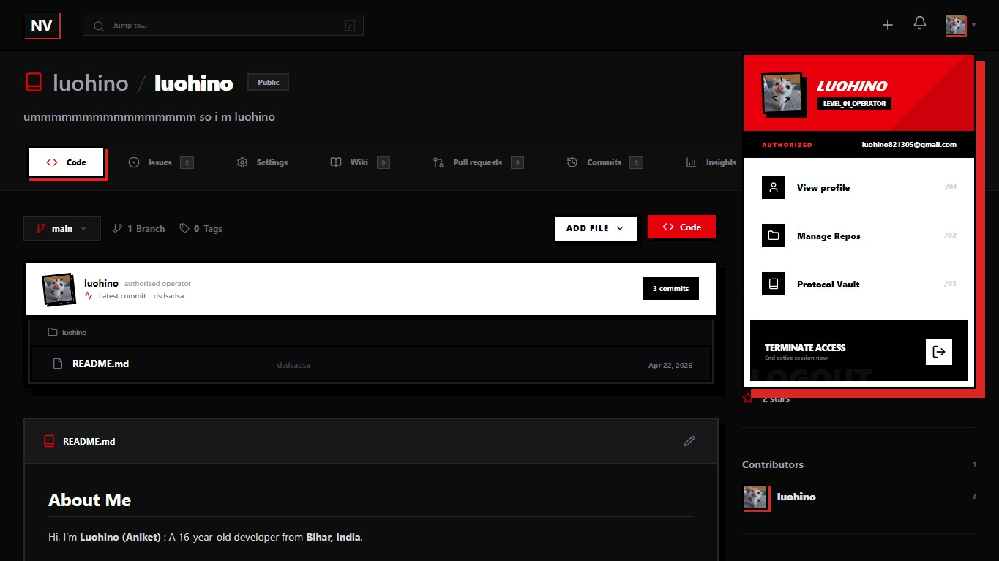 |

### IDE Hub (NV-Engine)
| IDE View | System Integration |
| :--- | :--- |
| **IDE** | 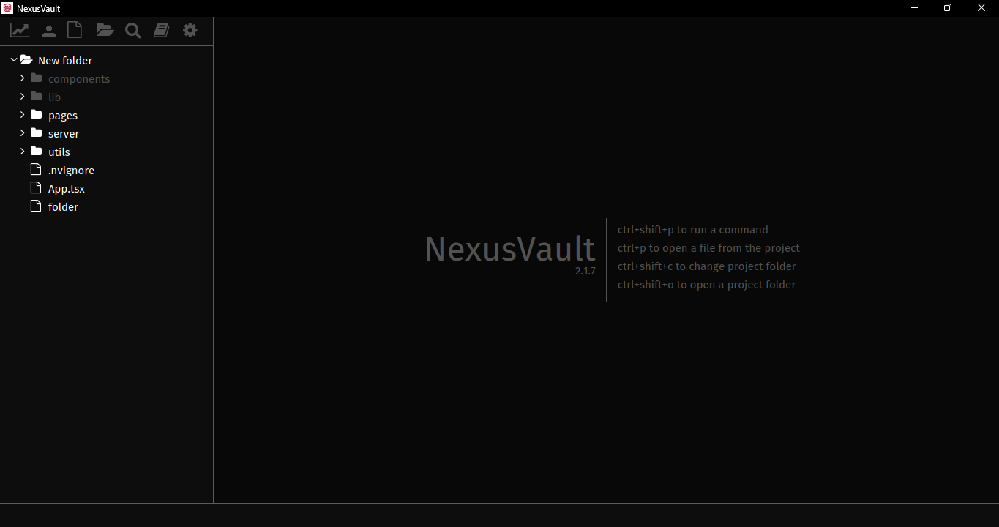 |
| **Code Ediotr** | 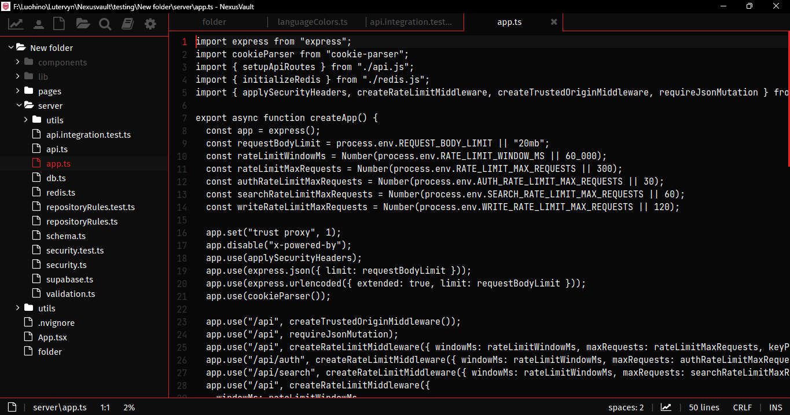 |
| **NexusTerminal** | 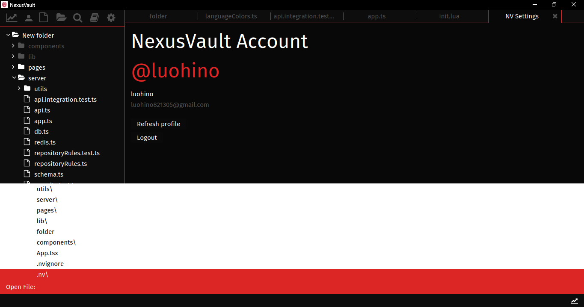 |

---

##  System Architecture

NexusVault operates on a multi-layered architecture designed to eliminate bottlenecks and ensure horizontal scalability.

### Core Request Lifecycle
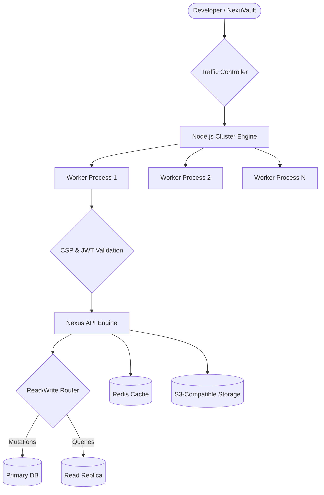

---

##  Under the Hood: IDE-to-Server Integration

NexusVault is unique in its "Local-First" approach, where the IDE handles the heavy lifting of delta tracking and metadata management.

### Lua API Communication (nv.lua)
The IDE uses a custom-built Lua plugin (`nv.lua`) to perform asynchronous, authenticated operations against the NexusVault API using system-level CURL.

```lua
-- Example: Core API POST handler in nv.lua
local function run_json_post(url, token, payload, payload_is_inline)
  local curl = PLATFORM == "Windows" and "curl.exe" or "curl"
  local args = {
    curl, "-sS", "-X", "POST", url,
    "-H", "Content-Type: application/json",
  }
  if payload_is_inline then
    table.insert(args, "-d")
    table.insert(args, payload)
  else
    table.insert(args, "--data-binary")
    table.insert(args, "@" .. payload)
  end
  if token and token ~= "" then
    table.insert(args, "-H")
    table.insert(args, "Authorization: Bearer " .. token)
  end
  -- Non-blocking process execution
  local proc, err = process.start(args, {
    stdout = process.REDIRECT_PIPE,
    stderr = process.REDIRECT_PIPE
  })
  return proc:wait(300)
end
```

### Push Lifecycle Transaction
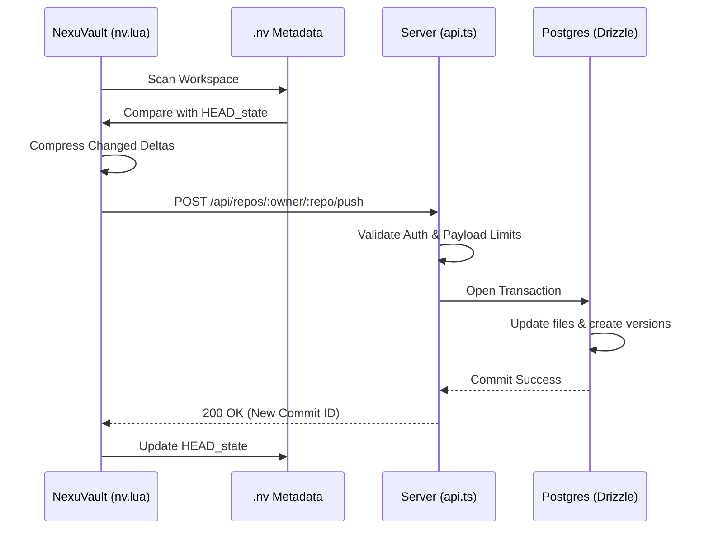

---

## Core Technical Stack

| Layer | Technology | Operational Role |
| :--- | :--- | :--- |
| **Frontend Framework** | React 18 | Real-time UI rendering and dynamic code browsing. |
| **Build Tooling** | Vite | Ultra-fast development and optimized production assets. |
| **Styling** | Tailwind CSS | Consistent Neo-Brutalist design tokens. |
| **Server Engine** | Node.js / TS | High-concurrency cluster with worker process management. |
| **Data Backbone** | PostgreSQL | Source of truth for repositories, commits, and users. |
| **Speed Layer** | Redis | High-speed cache for metadata and session stability. |
| **IDE Engine** | NexuVault (Lua) | Lightweight, C-powered editor for local-first operations. |
| **Identity** | Clerk | Secure user authentication and session management. |

---

##  Architecture Deep Dive

### Local Metadata (.nv Directory)
The `.nv` directory is the core of the NexusVault local engine. It contains:
- `config`: Stores remote URLs and authentication tokens.
- `HEAD_state`: A high-performance flat file mapping every tracked file to its last-known server timestamp.
- `HEAD`: The current branch reference.

### Data Modeling & Relations
NexusVault uses a structured relational schema to maintain the integrity of code snapshots and version history.

| Entity | System Role | Relationship |
| :--- | :--- | :--- |
| **Users** | Operators | Owns multiple repositories; authors commits and issues. |
| **Repositories** | Project Containers | Linked to an owner; contains files, commits, and metadata. |
| **Commits** | State Snapshots | Belongs to a repository; links to multiple file versions. |
| **Files** | Current Buffer | The latest state of a file in a repository. |
| **File Versions** | Delta History | Immutable snapshots of files linked to specific commit IDs. |

### High-Concurrency Deployment
The server uses a **Master/Worker Clustering Model** to utilize 100% of the host's CPU threads.
- **Read/Write Splitting**: Mutation traffic is pinned to the primary database, while search and listing operations are distributed across read-replicas.
- **MIME Detection**: The `GET /api/repos/.../raw/` API provides automatic content-type headers for images and code, enabling perfect README rendering.

---

##  Security & Performance Engineering

NexusVault implements several layers of hardening to ensure stability under high load and protection against common attack vectors.

### SQL Injection Protection (Pattern Escaping)
All search-based queries utilize a specialized escaping utility to prevent `ILIKE` pattern-based injection attacks.

```typescript
// src/server/validation.ts
export function escapeLikePattern(pattern: string): string {
  // Escapes % and _ which are special characters in SQL LIKE/ILIKE patterns
  return pattern.replace(/[%_]/g, (match) => `\\${match}`);
}
```

### Network & Load Optimization
To minimize latency and maximize throughput, the following middlewares are integrated into the core application:

| Optimization | Implementation | Rationale |
| :--- | :--- | :--- |
| **Gzip Compression** | `compression()` middleware | Reduces API payload size by up to 70% for large file snapshots. |
| **Static Caching** | `maxAge: '1d'` headers | Offloads repeat asset requests to the browser cache for 24 hours. |
| **Rate Limiting** | `express-rate-limit` | Protects expensive auth and search routes from brute-force/DoS attempts. |

---

## Technical CLI Reference

| Command | Action | System Impact |
| :--- | :--- | :--- |
| `nv init` | Initialization | Generates the `.nv` directory and initial state tracking. |
| `nv login` | Authentication | Negotiates the CLI browser handshake for a signed JWT. |
| `nv status` | Intelligence | Computes local vs remote deltas using `HEAD_state`. |
| `nv push` | Synchronization | Atomic transmission of changes to the server transaction layer. |
| `nv remote` | Configuration | Manages the `remote.<name>.url` values in the local config. |

---

<p align="center">
  <b>High-Fidelity Engineering. Zero Latency.</b><br>
  NexusVault Development Command
</p>
